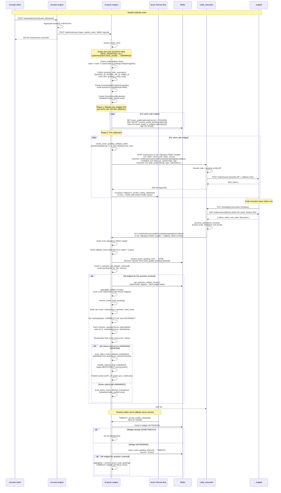
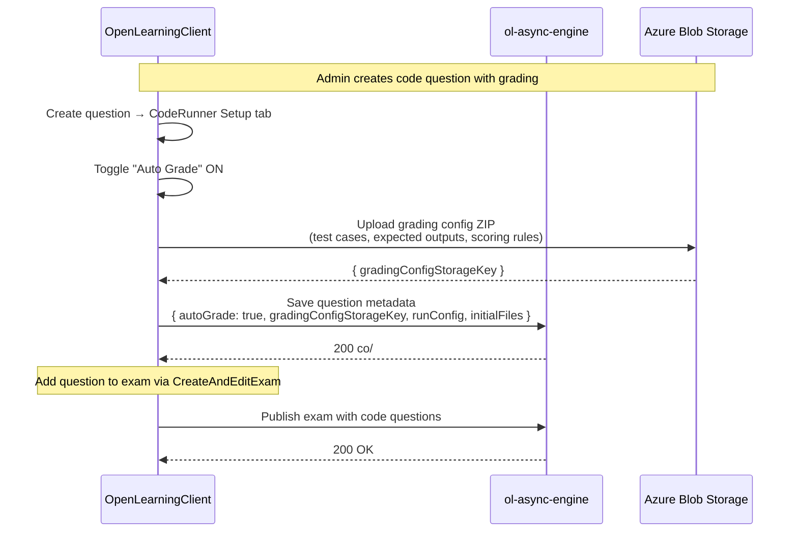
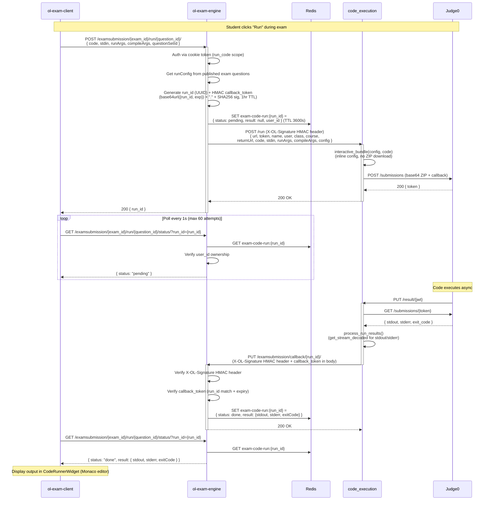

# Plan: Exam Code Grading Flow (Full End-to-End)

## TL;DR

When a student submits an exam with code questions, ol-async-engine auto-grades non-code questions immediately and fires async code execution for code questions via the `/submission` endpoint on code_execution. Results callback to ol-async-engine, which updates evaluation records. Students can also run code interactively during the exam via ol-exam-engine proxying to code_execution's `/run` endpoint.

**Repos involved:** ol-async-engine, code_execution, ol-exam-engine, ol-exam-client, OpenLearningClient

---

## Architecture Decision: Two Paths

**For grading (on exam submit):** ol-exam-engine → (submit_exam webhook) → ol-async-engine → code_execution `/submission` → callback → ol-async-engine → update evaluations

**For interactive run (during exam):** ol-exam-client → ol-exam-engine → code_execution `/run` → callback → ol-exam-engine → poll → ol-exam-client

**Rationale:** Interactive runs go through ol-exam-engine directly (one fewer hop, lower latency). Grading goes through ol-async-engine where evaluation logic already lives.

---

## Sequence Diagrams

### Grading Flow (on exam submit)



### Admin Grading Config Setup



### Interactive Run Flow (during exam)



---

## Phase 1: Backend Grading Pipeline (ol-async-engine)

### ✅ Step 1.1 — Detect code questions in assess_exam_txn

_Files:_ `resources/exam_resource/helpers/exam_submission_helper.py`, `resources/question_bank_resource/helpers/converter_helper.py`

- Added explicit `CodeInteraction.check_result()` returning `{status: UNMARKED, correctKeys: [], ...}` — base class would raise `NotImplementedError`
- In `assess_exam_txn()`, after `check_question_result()`, loops over question sections detecting `type == "code"` with `autoGrade=True` and `gradingConfigStorageKey` set
- Collects into `pending_code_executions: list[dict]` with: `{question_id, question_set_id, widget_id, code_files, grading_config_key}`
- `assess_exam_txn` return updated to include `pending_code_executions` and `exam_attempt_id`; added fallback return dict for the `handle_replace_final_evaluation → None` edge case
- `submit_exam` pops `pending_code_executions` and `exam_attempt_id` from `event_data` before passing to `publish_report_results_updated_events`; guards LTI/event publishing with `if evaluation_after:`

### ✅ Step 1.2 — Track pending code executions per exam attempt

_New file:_ `resources/code_execution_resource/exam_grading_helpers.py`

- Redis-backed tracking scoped by **widget** (not question) because a single question can have multiple code widgets, each graded independently
- **Key design note**: `widget_id` is only unique within a question, so both `question_id` and `widget_id` are needed to avoid cross-question key collisions
- Key pattern: `exam_grade:{exam_attempt_id}:{question_id}:{widget_id}` → `{status: CodeRunStatus, result: dict | null}`
- Pending set: `exam_grade_pending:{exam_attempt_id}` → JSON `list[str]` of `"{question_id}:{widget_id}"` tokens
- TTL: 3600s
- Functions:
  - `create_exam_grading_run(exam_attempt_id, question_id, widget_id)` → sets PENDING state, adds token to pending set
  - `get_exam_grading_state(exam_attempt_id, question_id, widget_id)` → reads current state
  - `resolve_exam_grading_run(exam_attempt_id, question_id, widget_id, result) -> bool` → marks DONE, removes from pending set, returns `True` if last pending
  - `mark_exam_grading_timeout(exam_attempt_id, question_id, widget_id) -> bool` → marks TIMEOUT, same return semantics

### ✅ Step 1.3 — Fire code execution from assess_exam_txn

_Files:_ `resources/exam_resource/helpers/exam_submission_helper.py`, `resources/code_execution_resource/client.py`

- After assess_exam_txn completes (non-code questions graded, code questions marked UNMARKED):
  - For each code question, call `send_submission_webhook()` (new function in client.py)
  - Payload: code files + grading config storage key + callback URL
  - Callback URL: `{OL_ORIGIN}/webhook/exam/codeResult/{exam_attempt_id}/{question_id}/{widget_id}/callback`
  - Include callback token (signed, binds to exam_attempt_id + question_id + widget_id)
  - Store pending state in Redis via `create_exam_grading_run(attempt_id, question_id, widget_id)`

- `send_submission_webhook()` in `client.py`:
  - POST to `{CODE_EXECUTION_URL}/submission`
  - HMAC-signed request
  - Payload structure matches `SubmissionWebhookPayload` (code_execution repo)
  - Include returnUrl pointing back to ol-async-engine callback

### ✅ Step 1.4 — Callback endpoint for grading results

_Files:_ `middlewares/webhook/main.py`, new `middlewares/webhook/exam_code_grading_helper.py`

- New endpoint: `PUT /webhook/exam/codeResult/{exam_attempt_id}/{question_id}/{widget_id}/callback`
- Verify HMAC signature (using CODE_EXECUTION_SECRET)
- Verify callback token (binds to exam_attempt_id + question_id + widget_id)
- Extract score + feedback from result (SubmissionReturnData format: status, score, text, feedback)
- Call `resolve_exam_code_grading()` (Step 1.5)

### ✅ Step 1.5 — Update evaluations with code grading results

_New file or addition to:_ `resources/exam_resource/helpers/exam_code_grading_helper.py`

- `resolve_exam_code_grading(exam_attempt_id, question_id, result)`:
  1. Update `ExamAttemptCriterionEvaluation` for this question:
     - Set `questionScore` from result.score
     - Set `markingStates` to CORRECT/INCORRECT based on score
     - Set `autoMarked = True`
     - Store result feedback/text as additional data
  2. Update `AssessmentCriterionEvaluation` (the "latest" record):
     - Same fields as above
  3. Remove from pending set (Step 1.2)
  4. Check if all code questions for this attempt are graded (`get_pending_count`)
  5. If all done:
     - Recalculate total exam score (sum all criterion evaluations)
     - Update `ExamAttemptEvaluation.givenScore`, `.isMarked = True` (if no other UNMARKED questions)
     - Update `AssessmentEvaluation` via `handle_replace_final_evaluation()`
     - Publish events: `publish_report_results_updated_events()`, LTI grade sync, xAPI
  6. Store result in Redis tracking (for potential polling)

### ✅ Step 1.6 — Timeout handling

_Files:_ `resources/code_execution_resource/exam_grading_helpers.py`

- If code execution doesn't callback within TTL (1 hour):
  - Mark question as ERROR state
  - Keep as UNMARKED (admin must manually re-trigger or grade)
  - Log error for monitoring

---

## Phase 2: Per-Widget Result Persistence via Stamp Collection

**Motivation:** Redis coordination state is ephemeral (TTL 3720s). Once aggregation fires, raw per-widget results (score, feedback, test output) are lost. Students need to see per-widget feedback in the exam review UI; without persistence this is impossible after the TTL.

**Approach — keep Redis for coordination + write a Stamp document per widget at aggregation time:**

- Redis continues to own coordination (fast, TTL-scoped, unchanged)
- At aggregation time (`resolve_exam_code_grading`), write one `Stamp` document per code widget into the shared `stamp` MongoDB collection (same collection used by webhook integrations and Turnitin)
- No new collection, no schema migration — `stamp` already exists and is indexed

**Why Stamp fits perfectly:**

- New `provider = "codeexecution"` keeps code execution results separate from generic webhook stamps — no risk of collisions with existing webhook or Turnitin providers
- `CodeExecutionStampData` extends the webhook data shape with one extra field (`widgetId`): `status`, `score {value, max}`, `text`, `feedback: list[{type, title, url, text}]`, `widgetId`
- `Stamp.resourceName` / `Stamp.resourceId` scopes the stamp to its subject — we use `resourceName="examAttemptCriterionEvaluation"` and `resourceId=examAttemptCriterionEvaluationId` for precise lookup
- A criterion can have multiple code widgets — each widget writes its own stamp document under the same `resourceId`, differentiated by `data.widgetId`; querying `{resourceName, resourceId, provider: "codeexecution"}` returns all widget stamps for that criterion in one shot
- Stamp already has a compound index on `(resourceName, resourceId, provider)` — O(1) lookup at read time
- OpenLearningClient and ol-exam-client can query stamps by resource in the same way all other stamp consumers do

**ol-async-engine writes to `stamp` directly** via `get_db()["stamp"]` (plain motor/pymongo dict insert — no mongoalchemy needed, same pattern as all other ol-async-engine Mongo writes).

### Step 2.1 — Write Stamp documents in resolve_exam_code_grading

_Files:_ `resources/exam_resource/helpers/exam_code_grading_helper.py`

- After `aggregate_widget_results`, loop over all widget states from `get_question_widget_results`
- For each widget, upsert a stamp document into `get_db()["stamp"]`:
  ```python
  {
      "resourceName": "examAttemptCriterionEvaluation",
      "resourceId": str(exam_attempt_criterion_evaluation_id),
      "provider": "codeexecution",
      "data": {
          "widgetId": widget_id,
          "timestamp": int(utc_now().timestamp()),
          "status": "success" | "error",   # DONE→success, TIMEOUT→error
          "score": {"value": float, "max": float},
          "text": {"value": str} | None,   # summary text from code_execution
          "feedback": [...] | None,        # test results, diffs, HTML iframes
          "visibility": "class",
      }
  }
  ```
- Use `update_one(..., upsert=True)` keyed on `(resourceName, resourceId, provider, "data.widgetId")` so each widget gets its own document and re-runs are idempotent

### Step 2.2 — Expose stamp lookup in exam evaluation API

_Files:_ `resources/exam_resource/helpers/exam_attempt_helper.py` or evaluation fetch helpers in ol-async-engine/ol-exam-engine

- Add a helper `get_code_widget_stamps(exam_attempt_criterion_evaluation_ids)` that queries `stamp` collection by `resourceName="examAttemptCriterionEvaluation"`, `provider="codeexecution"`, and `resourceId` in the given list of IDs — returns all widget stamps for each criterion in one query
- Include stamp data alongside criterion evaluation responses so ol-exam-engine and OpenLearningClient can surface it

---

## Phase 3: Code Execution Service (code_execution)

### ✅ Step 3.1 — Verify /submission endpoint handles exam grading

_Files:_ `receive_hook/receive.py`, `receive_hook/payload.py`

- Ensure `SubmissionWebhookPayload` supports:
  - Code files from submitted data
  - Grading config from `configFile` (downloaded via its storage key URL)
  - returnUrl pointing to ol-async-engine callback
- Verify `receive_submission()` properly bundles code + grading config
- The grading config ZIP should contain test cases, expected outputs, scoring rules

### ✅ Step 3.2 — Verify respond flow for submission results

_Files:_ `respond_hook/respond.py`, `results/submission_result_processor.py`

- Ensure `process_submission_results()` extracts:
  - score (from ScoreConfig in grading config)
  - status (success/error)
  - feedback items (test results, diff output, etc.)
- Ensure `send_response()` calls back to the returnUrl with HMAC-signed result
- Result format: `SubmissionReturnData { status, score, text, feedback }`

### ✅ Step 3.3 — Ensure proper payload mapping

_Files:_ `receive_hook/payload.py`, `submission_config/config_model.py`

- The POST /submission payload from ol-async-engine must match SubmissionWebhookPayload
- Fields needed: url, token, returnUrl, configFile (or inline config), response.data.code (list of StringFile)
- Map from exam submission data → code_execution expected format

---

## Phase 4: Exam Engine Integration (ol-exam-engine)

### ✅ Step 4.1 — Include code data in submit_exam webhook

_Files:_ `api/exam_submission/helper.py`

- In `send_exam_submission_to_ol_engine()`:
  - For code questions, include the full code files in `submission_data[question_set_id][question_id]`
  - Include any metadata needed (language, widget config reference)
- Ensure QuestionSubmissionModel `submitted_data` properly stores code files

### ✅ Step 4.2 — Add interactive run endpoints (for student run during exam)

_New file:_ `api/exam_submission/code_run_router.py` (or add to existing router)

- `POST /examsubmission/{exam_id}/run/{question_id}/` — trigger interactive code run
  - Auth: exam session token
  - Extract code from request body
  - Get question metadata (runConfig) from published exam questions
  - Call code_execution `/run` directly (HMAC-signed)
  - Store run state in Redis: `exam_run:{run_id}` → `{status: pending}`
  - Return `{run_id}`

- `GET /examsubmission/{exam_id}/run/{question_id}/status/?run_id={run_id}` — poll for results
  - Auth: exam session token
  - Read from Redis
  - Return `{status, result: {stdout, stderr, exit_code}}`

### ✅ Step 4.3 — Add code execution callback endpoint

_Files:_ `api/exam_submission/code_run_router.py`

- `PUT /examsubmission/callback/{run_id}/` — receive results from code_execution
  - Verify HMAC signature
  - Verify callback token
  - Store result in Redis
  - Return 200

### ✅ Step 4.4 — Settings for code execution

_Files:_ settings module

- Add `CODE_EXECUTION_URL` and `CODE_EXECUTION_SECRET` environment variables
- Add HMAC signing utility (similar to existing webhook signature code)

---

## Phase 5: Exam Client UI (ol-exam-client)

### ✅ Step 5.1 — Add CodeExecution widget type

_Files:_ `src/resource/Exam/types.ts`, `src/resource/QuestionBank/types.ts`, `src/components/QuestionDisplay/renderers.tsx`

- Added `CodeRunnerWidget` to `WidgetReference` union in `src/resource/Exam/types.ts`
- Added `CodeRunnerInteraction` to `questionDetail` union in `src/resource/Exam/types.ts`
- Added `{ files: Array<{filename, content}> }` to `AnswerItem` union (CodeAnswerItem)
- Added `CodeFile`, `CodeRunConfig`, `CodeRunnerInteraction` types to `src/resource/QuestionBank/types.ts`
- Added `CodeRunnerInteraction` to `InteractionProps`
- Added `'native/OpenLearning/CodeWidget': CodeExecution` to `QUESTION_RENDERER_MAPPING`

### ✅ Step 5.2 — Build CodeEditor component

_New files:_

- `src/components/QuestionDisplay/Interaction/CodeExecution/hooks.ts` — `useCodeRun()` hook that posts to `/examsubmission/{examId}/run/{questionId}/` and polls status; `OnRunCodeParams` uses openlearningui `{ id, name, content }` file shape and converts to `{ filename, content }` for the API
- `src/components/QuestionDisplay/Interaction/CodeExecution/component.tsx` — Uses `CodeRunnerWidget` from `@openlearningnet/openlearningui` (upgraded to 1.2.37-beta.6); scratchpad restore converts `{ filename, content }` ↔ `{ id, name, content }` for the widget; `onChange` persists files back via `UPDATE_QUESTION_VALUES`; `onRunCode` delegates to `useCodeRun`
- `package.json` updated: `@openlearningnet/openlearningui` bumped from `1.2.33` to `1.2.37-beta.6`

### ✅ Step 5.3 — Integrate with exam submission flow

- Answer stored as `questionValues[index] = { files: [{filename, content}] }` (index-keyed)
- ol-exam-engine's `generate_refined_answers` maps `str(index)` → `widget_id` key for the grading payload — no changes needed to ExamRunner

### ✅ Step 5.4 — Initial files from question config

- `CodeExecution` component restores files from scratchpad (`questionValues[index]`) on load, falling back to `initialFiles` from question metadata
- `questionSetId` is now passed through `SectionInteractionRenderer` → `RendererComponent` (added to type + @ts-ignore forwarding)

### ✅ Step 5.5 — API functions

_File:_ `src/resource/Exam/api/examApi.ts`

- Added `CodeRunRequest`, `CodeRunStatusResponse` types
- Added `runCode()` — POST `/examsubmission/{examId}/run/{questionId}/`
- Added `getCodeRunStatus()` — GET `/examsubmission/{examId}/run/{questionId}/status/?run_id=`

---

## Phase 6: Admin UI Enhancements (OpenLearningClient)

### ✅ Step 6.1 — Wire gradingConfig for exam code questions

_Files:_ `src/web/components/Assessment/QuestionBank/.../CodeRunner/Setup/component.tsx`

- Already has grading config upload UI (gradingConfigStorageKey)
- Already has autoGrade toggle
- Verify the grading config is properly stored in question metadata and passed through to exam definitions

### ✅ Step 6.2 — Display code grading results in admin grading view

_Files:_ `src/web/containers/Assessment/Exams/AnalyseExam/component.tsx`, `src/web/components/Assessment/QuestionBank/QuestionPreviewSidebar/component.tsx`

- **AnalyseExam**: When `question.widgets?.[0] === 'code'` and all `markingStates` are `'unmarked'`, show "Grading..." text instead of "Grade" button. Non-code questions with `'unmarked'` states still show "Grade" for manual grading.
- **QuestionPreviewSidebar**: After the score row, if `question.widgets?.includes('code')`, show a status line: "Pending auto-grade" (`BLACK_55`) while all states are `'unmarked'`, or "Auto-graded" (`ALGAE`) once graded.

### ✅ Step 6.3 — Exam grading result format display (submitted code view)

_Files:_ `src/web/components/Assessment/QuestionBank/QuestionPreviewModal/Interaction/CodeRunner/component.tsx`

- `CodeRunner` now reads `questionValues[index]` via `useQuestionPreview()`. If submitted files are present (`{ filename, content }` format), they are converted to `{ id, name, content }` (openlearningui `CodeFile` format) and used as `initialFiles` to `CodeRunnerWidget`. Falls back to `initialFiles` from question definition when no submission is present (e.g. during question setup preview).

---

## Phase 7: Student Exam Review — Per-Widget Feedback (ol-exam-client)

**Motivation:** Redis coordination state is ephemeral (TTL 3720s). Once aggregation fires, raw per-widget results (score, feedback, test output) are lost. Students need to see per-widget feedback in the exam review UI; without persistence this is impossible after the TTL.

**Approach — keep Redis for coordination + write a Stamp document per widget at aggregation time:**

- Redis continues to own coordination (fast, TTL-scoped, unchanged)
- At aggregation time (`resolve_exam_code_grading`), write one `Stamp` document per code widget into the shared `stamp` MongoDB collection (same collection used by webhook integrations and Turnitin)
- No new collection, no schema migration — `stamp` already exists and is indexed

**Why Stamp fits perfectly:**

- New `provider = "codeexecution"` keeps code execution results separate from generic webhook stamps — no risk of collisions with existing webhook or Turnitin providers
- `CodeExecutionStampData` extends the webhook data shape with one extra field (`widgetId`): `status`, `score {value, max}`, `text`, `feedback: list[{type, title, url, text}]`, `widgetId`
- `Stamp.resourceName` / `Stamp.resourceId` scopes the stamp to its subject — we use `resourceName="examAttemptCriterionEvaluation"` and `resourceId=examAttemptCriterionEvaluationId` for precise lookup
- A criterion can have multiple code widgets — each widget writes its own stamp document under the same `resourceId`, differentiated by `data.widgetId`; querying `{resourceName, resourceId, provider: "codeexecution"}` returns all widget stamps for that criterion in one shot
- Stamp already has a compound index on `(resourceName, resourceId, provider)` — O(1) lookup at read time
- OpenLearningClient and ol-exam-client can query stamps by resource in the same way all other stamp consumers do

**ol-async-engine writes to `stamp` directly** via `get_db()["stamp"]` (plain motor/pymongo dict insert — no mongoalchemy needed, same pattern as all other ol-async-engine Mongo writes).

### Step 7.1 — Display per-widget feedback in admin grading view

_Files:_ `src/web/components/Assessment/QuestionBank/QuestionPreviewSidebar/component.tsx`

- Call `getStampForResources({ resourceName: "examAttemptCriterionEvaluation", resourceId: criterionEvaluationId })` — returns a list of stamps, one per code widget under that criterion
- Each stamp in the list carries `data.widgetId` so the client can map each stamp back to its widget and render results independently
- Render per-widget score breakdown and feedback alongside the aggregated criterion score
- Extends Phase 6 Step 6.2; uses stamp data instead of a custom sub-document

---

## Relevant Files

### ol-async-engine

- `resources/exam_resource/helpers/exam_submission_helper.py` — modify assess_exam_txn to detect code questions, fire executions
- `resources/code_execution_resource/client.py` — add `send_submission_webhook()`
- `resources/code_execution_resource/helpers.py` — reference for Redis patterns
- `resources/code_execution_resource/exam_grading_helpers.py` — NEW: exam grading tracking
- `middlewares/webhook/main.py` — add grading result callback endpoint
- `middlewares/webhook/exam_code_grading_helper.py` — NEW: handle grading results
- `resources/assessment_evaluation_resource/model.py` — reference: ExamAttemptCriterionEvaluation, ExamAttemptEvaluation models
- `resources/question_bank_resource/helpers/converter_helper.py` — reference: interaction_converter dict, CodeInteraction type
- `CODE_EXECUTION_PLAN.md` — reference for existing interactive run architecture

### code_execution

- `receive_hook/payload.py` — verify SubmissionWebhookPayload structure
- `receive_hook/receive.py` — verify receive_submission() flow
- `respond_hook/respond.py` — verify respond flow for submissions
- `results/submission_result_processor.py` — verify result processing
- `submission_config/config_model.py` — reference: ConfigModel (grading config structure)
- `submission_config/bundler.py` — reference: how config + code are bundled

### ol-exam-engine

- `api/exam_submission/helper.py` — modify to include code data in webhook payload
- `api/exam_submission/router.py` — add interactive run endpoints
- `api/exam_submission/code_run_router.py` — NEW: code run proxy endpoints + callback
- `api/common/` — reference for auth, settings patterns

### ol-exam-client

- `src/components/QuestionDisplay/renderers.tsx` — add code widget mapping
- `src/components/QuestionDisplay/Interaction/CodeExecution/` — NEW: code editor + runner component
- `src/containers/Exam/ExamRunner.tsx` — wire code answers into submission flow
- `src/resource/Exam/types.ts` — add code question types

### OpenLearningClient

- `src/web/components/Assessment/QuestionBank/.../CodeRunner/Setup/component.tsx` — reference: existing setup UI
- `src/web/containers/Assessment/Exams/AnalyseExam/component.tsx` — enhance grading display
- `src/web/components/Assessment/QuestionBank/QuestionPreviewSidebar/component.tsx` — enhance result display

---

## Verification

1. **Unit test assess_exam_txn** — Mock code question in submission_data, verify it marks UNMARKED and fires code execution webhook
2. **Integration test callback** — Simulate code_execution callback to `/webhook/exam/codeResult/{attempt_id}/{question_id}/callback`, verify evaluations are updated
3. **Test multi-question grading** — Submit exam with 2 code questions, verify partial updates and final score recalculation when both complete
4. **Test timeout handling** — Verify UNMARKED state persists and admin can manually grade if execution times out
5. **Test interactive run (ol-exam-engine)** — Call run endpoint, mock code_execution, verify result polling works
6. **E2E test (exam client)** — Create exam with code question, take exam, run code, submit, verify grading completes
7. **Manual test** — Admin creates code question with grading config → student takes exam → runs code → submits → admin sees auto-graded results in grading sidebar

---

## Decisions

- **Async grading**: Code questions marked UNMARKED initially; updated when results arrive. Non-code questions graded inline as before.
- **Interactive runs go through ol-exam-engine directly** to code_execution (lower latency). Grading goes through ol-async-engine (where evaluation logic lives).
- **Grading config = admin-uploaded ZIP** via `gradingConfigStorageKey` in question metadata.
- **Score extraction** uses code_execution's existing pattern (ScoreConfig in grading config ZIP).
- **Multiple code questions per exam** supported — each tracked independently at the widget level, overall score recalculated when all pending widgets complete.
- **Tracking granularity is widget_id, not question_id** — a question can have multiple code widgets; each is a separate grading job. Both `question_id` + `widget_id` are in the Redis key to prevent cross-question collisions.
- **Scope includes**: All 4 repos. Scope excludes: WebSocket upgrade (polling only), retry UI for failed executions, advanced test case editor.

---

## Further Considerations

1. **Grading Config Download**: ol-async-engine needs to download the grading config ZIP from its storage key before sending to code_execution. Needs to resolve the storage key to a URL. Option A: pass storage key URL to code_execution and let it download. Option B: ol-async-engine downloads and includes inline. Recommend Option A (code_execution already handles configFile downloads).

2. **Interactive run auth flow**: ol-exam-engine calling code_execution `/run` needs HMAC auth (same secret as ol-async-engine uses). This means ol-exam-engine needs its own `CODE_EXECUTION_SECRET` env var. Alternatively, route interactive runs through ol-async-engine too (consistency but higher latency).

3. **Partial score visibility**: When some code questions are still grading, should the student see partial results (non-code scores only)? Recommend: show "Grading in progress" for code questions, show scored results for non-code questions. The `isMarked` flag on ExamAttemptEvaluation stays false until all questions are graded.

---

## Remaining TODOs

> The Redis race condition in `exam_grading_helpers.py` has been fixed (replaced JSON list read-modify-write with atomic `SADD`/`SREM`/`SCARD`/`SMEMBERS`). The items below are what remains.

### 🔴 High Priority — Correctness Bugs

#### TODO-2: `int(raw_score_max)` Truncates Fractional Scores

_File:_ `ol-async-engine/resources/exam_resource/helpers/exam_code_grading_helper.py`, line 109

```python
raw_score_denominator = int(raw_score_max) if raw_score_max > 0 else 1
```

If `raw_score_max` is `0.5`, `int(0.5)` = `0`, bypassing the `> 0` guard and falling back to denominator `1` — producing a wrong ratio. The `Fraction` import is already present but not used correctly for floats.

**Fix:**

```python
raw_fraction = Fraction(raw_score_value) / Fraction(raw_score_max) if raw_score_max > 0 else Fraction(0)
ratio = raw_fraction.limit_denominator(1000)
```

#### TODO-3: Timeout Handler No-Ops When Redis Key Already Expired

_File:_ `ol-async-engine/tasks/default/helpers/timeout_exam_code_grading_helper.py`

The timeout job fires at `_EXAM_GRADE_TIMEOUT_OFFSET = 3540s`. Redis keys expire at `_EXAM_GRADE_REDIS_TTL = 3720s` — only a 180-second window. If Service Bus delivers the message late, `get_exam_grading_state` returns `None` and the handler early-returns. The widget stays permanently unresolved — never scoring 0, never triggering aggregation.

**Fix:** When `state is None`, check if the question is still unresolved via `SCARD` and force aggregation:

```python
if state is None:
    if not await is_question_all_widgets_resolved(exam_attempt_id, question_id):
        widget_states = await get_question_widget_results(exam_attempt_id, question_id)
        if widget_states:
            aggregated = await aggregate_widget_results(widget_states)
            await resolve_exam_code_grading(exam_attempt_id, question_id, aggregated)
    return
```

---

### 🟡 Medium Priority — Missing Features

#### TODO-4: Implement Phase 2 — Stamp Persistence for Per-Widget Feedback

_File:_ `ol-async-engine/resources/exam_resource/helpers/exam_code_grading_helper.py`

Redis TTL is 3720s (~62 min). After that, all per-widget feedback (test results, score breakdown, diff output) is permanently lost. Students cannot see _why_ they got their score in the exam review UI.

In `resolve_exam_code_grading`, after aggregation, write one `stamp` document per widget into the `stamp` MongoDB collection:

```python
await get_db()["stamp"].update_one(
    {
        "resourceName": "examAttemptCriterionEvaluation",
        "resourceId": str(exam_attempt_criterion_evaluation_id),
        "provider": "codeexecution",
        "data.widgetId": widget_id,
    },
    {"$set": {
        "provider": "codeexecution",
        "data": {
            "widgetId": widget_id,
            "timestamp": int(utc_now().timestamp()),
            "status": "success" if state["status"] == CodeRunStatus.DONE else "error",
            "score": state.get("result", {}).get("score"),
            "text": state.get("result", {}).get("text"),
            "feedback": state.get("result", {}).get("feedback"),
            "visibility": "class",
        }
    }},
    upsert=True,
)
```

Also add `get_code_widget_stamps(exam_attempt_criterion_evaluation_ids)` helper to query stamps by `resourceName` + `provider="codeexecution"` + `resourceId` in the given list of criterion evaluation IDs — returns all widget stamps grouped by `resourceId`.

#### TODO-6: Add Admin Re-Grade Action

_File:_ `ol-async-engine/middlewares/webhook/main.py`

When grading times out or errors, there is no way for an admin to re-trigger grading without manual DB edits. Add:

- `POST /webhook/exam/codeResult/{attempt_id}/{question_id}/{widget_id}/regrade`
- Admin auth required
- Resets widget Redis state back to `PENDING`, re-fires `_fire_exam_code_execution`
- Returns `202 Accepted`

#### TODO-7: Rate-Limit Interactive Code Runs

_File:_ `ol-exam-engine/api/exam_submission/code_run_router.py`

No rate limiting on `POST /examsubmission/{exam_id}/run/{question_id}/{widget_id}/`. A student can spam the Run button and flood code_execution/Judge0.

**Fix:** Add a per-user, per-widget cooldown using Redis:

```python
cooldown_key = f"exam-run-cooldown:{user_id}:{widget_id}"
if await redis_client.exists(cooldown_key):
    raise HTTPException(status_code=429, detail="Please wait before running again")
await redis_client.setex(cooldown_key, 3, 1)  # 3-second cooldown
```

---

### 🟢 Low Priority — Code Quality

#### TODO-8: Replace Debug `print()` Statements with Structured Logging

_Files:_

- `ol-async-engine/resources/exam_resource/helpers/exam_code_grading_helper.py` — 10 `print(" ==== ...")` statements
- `ol-async-engine/middlewares/webhook/main.py` — 6 `print("====")` statements

**Fix:** Replace with `logging.getLogger(__name__)` and use `logger.debug()` / `logger.info()`. Prevents sensitive payload data (code content, scores) from being dumped to stdout in production.

#### TODO-9: Unit Tests for `exam_code_grading_helper.py`

_File:_ `ol-async-engine/tests/unit_tests/exam_resource/test_exam_code_grading_helper.py` _(new)_

Needed coverage:

- Score scaling with `Fraction` is correct
- `markingStates` set to `CORRECT` vs `INCORRECT` correctly
- Skips publishing when `is_not_marked=True`
- Idempotent when criterion already `autoMarked=True` (after TODO-1)
- Correct behaviour with fractional `raw_score_max` values (after TODO-2)

#### TODO-10: Unit Tests for `timeout_exam_code_grading_helper.py`

_File:_ `ol-async-engine/tests/unit_tests/test_tasks/test_timeout_exam_code_grading_helper.py` _(new)_

Needed coverage:

- Widget already `DONE` → no-op
- Widget `PENDING` → marks as `TIMEOUT`, triggers aggregation
- `state is None` (expired key) → graceful handling (after TODO-3)
- Aggregation fires only when all widgets for the question are resolved

---

### Summary Table

| ID      | Issue                                                                                                                                                                                         | File                                             | Priority         |
| ------- | --------------------------------------------------------------------------------------------------------------------------------------------------------------------------------------------- | ------------------------------------------------ | ---------------- |
| TODO-1  | ~~Duplicate callback writes criterion twice~~ Removed — duplicate protection is handled upstream in Redis before `resolve_exam_code_grading` is called; guard would block re-run integrations | `exam_code_grading_helper.py`                    | ~~🔴 High~~ Done |
| TODO-2  | `int(raw_score_max)` truncates fractional scores                                                                                                                                              | `exam_code_grading_helper.py`                    | 🔴 High          |
| TODO-3  | Timeout handler no-ops when Redis key already expired                                                                                                                                         | `timeout_exam_code_grading_helper.py`            | 🔴 High          |
| TODO-4  | Stamp persistence — per-widget feedback lost after 62 min                                                                                                                                     | `exam_code_grading_helper.py`                    | 🟡 Medium        |
| TODO-5  | Student exam review UI — no code feedback shown                                                                                                                                               | `ol-exam-client`                                 | 🟡 Medium        |
| TODO-6  | No admin re-grade action for failed/timed-out widgets                                                                                                                                         | `webhook/main.py`                                | 🟡 Medium        |
| TODO-7  | No rate limiting on interactive Run button                                                                                                                                                    | `code_run_router.py`                             | 🟡 Medium        |
| TODO-8  | Debug `print()` statements in production paths                                                                                                                                                | `exam_code_grading_helper.py`, `webhook/main.py` | 🟢 Low           |
| TODO-9  | No unit tests for `exam_code_grading_helper.py`                                                                                                                                               | `tests/`                                         | 🟢 Low           |
| TODO-10 | No unit tests for `timeout_exam_code_grading_helper.py`                                                                                                                                       | `tests/`                                         | 🟢 Low           |
