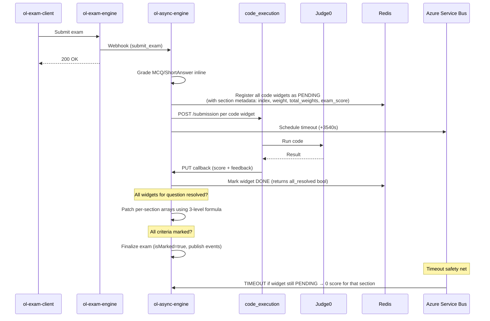

# Plan: Exam Code Grading Flow (Full End-to-End)

## TL;DR

When a student submits an exam with code questions, ol-async-engine auto-grades non-code questions immediately and fires async code execution for code questions via the `/submission` endpoint on code_execution. Results callback to ol-async-engine, which patches per-section scores using a 3-level weighted formula. Students can also run code interactively during the exam via ol-exam-engine proxying to code_execution's `/run` endpoint.

**Repos involved:** ol-async-engine, code_execution, ol-exam-engine, ol-exam-client, OpenLearningClient

---

## Architecture Decision: Two Paths

**For grading (on exam submit):** ol-exam-engine → (submit_exam webhook) → ol-async-engine → code_execution `/submission` → callback → ol-async-engine → update evaluations

**For interactive run (during exam):** ol-exam-client → ol-exam-engine → code_execution `/run` → callback → ol-exam-engine → poll → ol-exam-client

**Rationale:** Interactive runs go through ol-exam-engine directly (one fewer hop, lower latency). Grading goes through ol-async-engine where evaluation logic already lives.

---

## 3-Level Scoring Model

```
Level 1: Code execution score      (from Judge0, e.g. 10/10, 5/10)
Level 2: Widget weight in question  (section weight, e.g. 3/10)
Level 3: Question score in exam     (exam allocation, e.g. 10/30)

Per-widget contribution = (code_exec_value / code_exec_max)
                          × (section_weight / total_question_weights)
                          × question_exam_score
```

**Example:**
```
Exam A: 30 total
├── Question 1: 10 marks (weights: MCQ=5, code=3, code=2 → total=10)
│   ├── W1 (MCQ):  1     × 5/10 × 10 = 5.0
│   ├── W2 (code): 10/10 × 3/10 × 10 = 3.0
│   └── W3 (code): 5/10  × 2/10 × 10 = 1.0
│                              Total = 9.0 marks
└── Question 2: 20 marks ...
```

Both `_get_score` (submit time) and `_compute_widget_section_score` (callback time) use the same formula. Non-code sections (MCQ, FITB) are scored inline at submit time; code sections start as UNMARKED and are patched when callbacks arrive.

---

## TLDR Sequence Diagram



**3 key phases:**
1. **Submit** — ExamEngine receives, delegates to AsyncEngine immediately
2. **Execute** — AsyncEngine fans out code widgets to CodeExec → Judge0 async
3. **Resolve** — Callbacks trickle back; patch per-section scores; finalize when all widgets done (or timeout)

---

## Redis State Model

All keys include `question_set_id` (`"default"` for standalone, ObjectId string for question sets) because the same question can appear both standalone AND inside a question set.

```
exam_grade:{attempt}:{qset}:{question}:{widget}
  → JSON { status, result, section_index, section_weight, total_question_weights, question_exam_score }

exam_grade_pending:{attempt}:{qset}:{question}
  → Redis SET of pending widget_ids (SADD/SREM atomic)

exam_grade_q_widgets:{attempt}:{qset}:{question}
  → Redis SET of ALL widget_ids (frozen registry, SADD only)
```

**Timing:** TTL=3720s, timeout job fires at 3540s, 180s safety margin.

**Callback URL:** `/webhook/exam/codeResult/{attempt}/{qset}/{question}/{widget}/callback`

---

## Completed Implementation (Phases 1–6)

All phases are implemented and working:

| Phase | Description | Status |
|-------|-------------|--------|
| Phase 1 | Backend grading pipeline (ol-async-engine) | ✅ Done |
| Phase 2 | Stamp persistence for per-widget feedback | ✅ Done |
| Phase 3 | Code execution service (code_execution) | ✅ Done |
| Phase 4 | Exam engine integration (ol-exam-engine) | ✅ Done |
| Phase 5 | Exam client UI (ol-exam-client) | ✅ Done |
| Phase 6 | Admin UI enhancements (OpenLearningClient) | ✅ Done |

### Key Files

| File | Role |
|------|------|
| `exam_submission_helper.py` | `assess_exam_txn` detects code widgets, collects `pending_code_executions` with section metadata, fires webhooks |
| `exam_grading_helpers.py` | Redis state model — `create_exam_grading_run`, `resolve_exam_grading_run`, `mark_exam_grading_timeout`, `get_question_widget_states_map` |
| `exam_code_grading_helper.py` | `resolve_exam_code_grading` — patches per-section arrays, recalculates scores, writes stamps, publishes events |
| `client.py` | HMAC token create/verify, `send_submission_webhook` |
| `webhook/main.py` | Callback endpoint, signature verification |
| `timeout_exam_code_grading_helper.py` | Timeout sweeper — marks TIMEOUT, triggers scoring if last widget |
| `converter_helper.py` | `CodeInteraction.check_result()` → UNMARKED |

---

## Remaining TODOs

### 🔴 High Priority

#### TODO-3: Timeout Handler No-Ops When Redis Key Already Expired

_File:_ `timeout_exam_code_grading_helper.py`

Timeout fires at 3540s, Redis keys expire at 3720s — 180s window. If Service Bus delivers late, `get_exam_grading_state` returns `None` → handler early-returns. Widget stays permanently unresolved.

**Fix:** When `state is None`, check if pending SET also expired. If so, the question may need forced resolution via DB state rather than Redis.

---

#### REVIEW-4: No Concurrency Guard on `resolve_exam_code_grading`

_File:_ `exam_code_grading_helper.py`

Both callback and timeout paths can reach `resolve_exam_code_grading` simultaneously for the same question. No distributed lock or idempotency check. Could produce duplicate criterion documents, incorrect final scores, duplicate LTI/xAPI events.

**Fix:** Add a Redis-based distributed lock or compare-and-swap pattern before entering `resolve_exam_code_grading`.

---

### 🟡 Medium Priority

#### REVIEW-6: Stamp `widgetId` Stored Top-Level

_File:_ `exam_code_grading_helper.py`

`_write_widget_stamps` stores `widgetId` at the top level of the stamp document, not inside `data`. Standard Stamp schema expects all custom fields inside `data`. Generic stamp query tools won't find it.

---

#### REVIEW-7: No Retry on `send_submission_webhook` Failure

_File:_ `exam_submission_helper.py`

Transient failure → widget stays PENDING → timeout → student gets 0. No retry mechanism.

**Fix:** Add exponential backoff retry (2-3 attempts) or dead-letter queue.

---

#### REVIEW-8: SAS Token TTL Too Short

_File:_ `exam_submission_helper.py`

`_GRADING_CONFIG_SAS_TTL_SECONDS = 30 * 60` but grading window is 3600s. If Judge0 queue is backed up >30 min, config download fails.

**Fix:** Set to `_EXAM_GRADE_TTL` (3600s) or longer.

---

#### REVIEW-9: No Rate Limiting on Interactive Run

_File:_ `ol-exam-engine/code_run_router.py`

No per-user cooldown on `POST /examsubmission/{exam_id}/run/{question_id}/{widget_id}/`. Students can flood Judge0.

**Fix:** Redis-based per-user cooldown (3s).

---

#### Phase 7: Student Exam Review — Per-Widget Feedback Display

Stamps are persisted (Phase 2 done) but not yet surfaced in the student exam review UI (ol-exam-client) or admin grading sidebar (OpenLearningClient via stamp API).

---

### 🟢 Low Priority

#### REVIEW-11: `Score.max` Optional

`SubmissionReturnData.Score.max` can be `None`. Misconfigured grading config → silent 0 score. Should warn/error.

---

#### REVIEW-13: Unit Tests for Scoring Logic

No tests for `_compute_widget_section_score`, `resolve_exam_code_grading` scoring path, or timeout handler. Redis helpers have 16 tests.

---

### Summary Table

| ID | Severity | Issue | Status |
|----|----------|-------|--------|
| REVIEW-14 | 🔴 Critical | Scoring model mismatch — code widgets treated as entire question | ✅ Fixed |
| REVIEW-1 | 🔴 Major | TIMEOUT widgets contribute 0/0 → inflated scores | ✅ Fixed |
| REVIEW-2 | 🔴 Major | `code_files` always index 0 — multi-widget wrong code | ✅ Fixed |
| REVIEW-5 | 🟡 Medium | TOCTOU race on `is_question_all_widgets_resolved` | ✅ Fixed |
| REVIEW-10 | 🟢 Minor | `print()` leaks payloads to stdout | ✅ Fixed |
| REVIEW-12 | 🟢 Minor | `Fraction` precision inconsistency | ✅ Fixed |
| TODO-3 | 🔴 High | Timeout handler no-ops on expired Redis keys | Open |
| REVIEW-4 | 🔴 High | No concurrency guard on resolve | Open |
| REVIEW-6 | 🟡 Medium | Stamp widgetId top-level vs data convention | Open |
| REVIEW-7 | 🟡 Medium | No retry on webhook failure | Open |
| REVIEW-8 | 🟡 Medium | SAS token TTL too short | Open |
| REVIEW-9 | 🟡 Medium | No rate limiting on Run button | Open |
| Phase 7 | 🟡 Medium | Student review UI for code feedback | Open |
| REVIEW-11 | 🟢 Minor | Score.max optional → silent 0 | Open |
| REVIEW-13 | 🟢 Minor | Unit tests for scoring logic | Open |

---

## Decisions

- **3-level weighted scoring**: `code_exec × widget_weight × question_exam_score` — same formula at submit time and callback time
- **Per-widget section patching**: No aggregation. Each widget patches its own `section_index` in the existing per-section arrays. Non-code sections preserved.
- **Section metadata in Redis**: `section_index`, `section_weight`, `total_question_weights`, `question_exam_score` baked into Redis state at registration — avoids re-deriving question structure at callback time
- **`question_set_id` scoping**: All Redis keys, callback URLs, HMAC tokens, timeout messages, and criterion matching include `question_set_id` (`"default"` or ObjectId string) — prevents collisions when the same question appears standalone and in a set
- **Register ALL before fire ANY**: All widgets registered in Redis before any webhook fires — prevents fast callback seeing incomplete pending set
- **Atomic SADD/SREM**: Redis SET operations for pending tracking — no read-modify-write race
- **Return-value driven resolution**: `resolve_exam_grading_run` / `mark_exam_grading_timeout` return `remaining == 0` — callers use this directly instead of separate SCARD check (eliminates TOCTOU)
- **Fail-fast on corrupt data**: `IndexError` raised if `section_index` exceeds per-section array bounds — no silent zero-padding
- **Async grading**: Code sections marked UNMARKED at submit time; patched when callbacks arrive. Non-code sections graded inline.
- **Two execution paths**: Interactive runs → ol-exam-engine → code_execution (low latency). Grading → ol-async-engine → code_execution (evaluation logic).
- **Stamps for persistence**: Per-widget results written to MongoDB `stamp` collection at scoring time — survives beyond Redis TTL for exam review UI.
